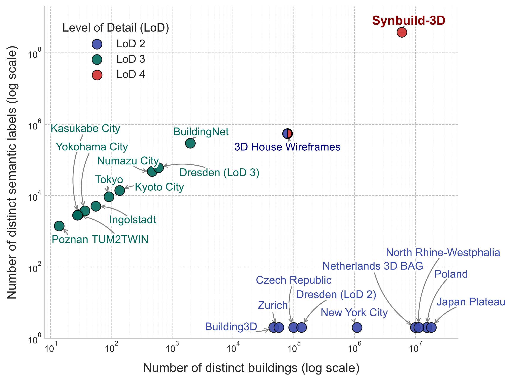
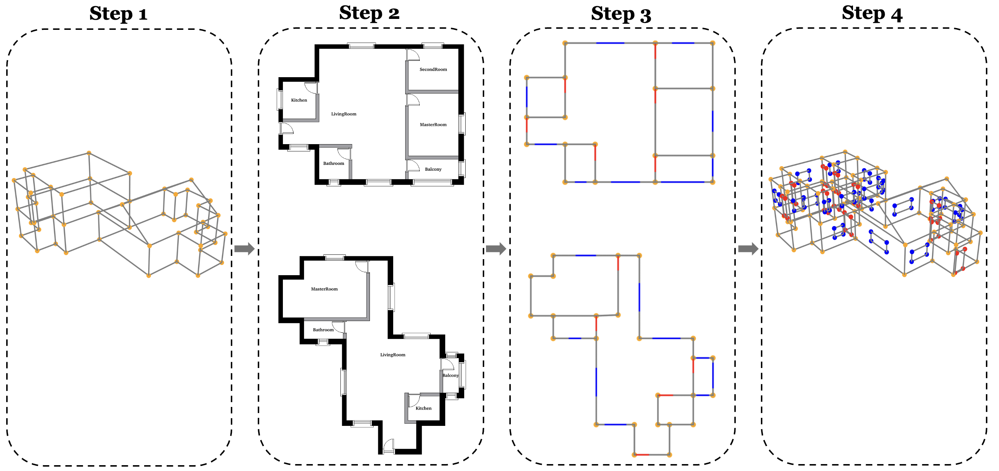
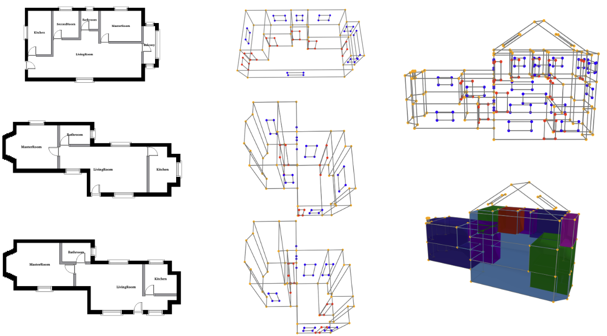
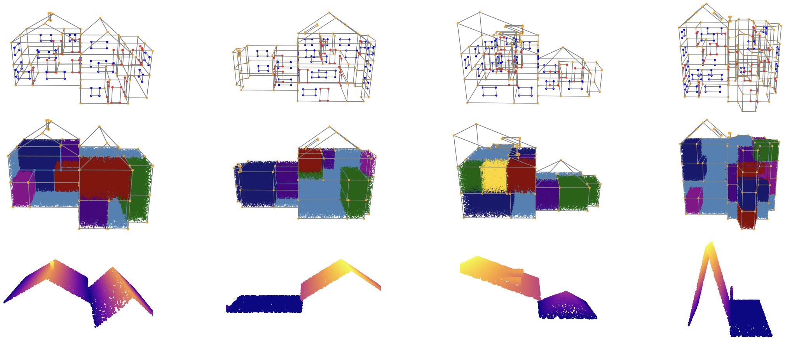

## SYNBUILD-3D: Dataset and Visualization Code



This repository contains code and instructions for working with the SYNBUILD-3D dataset, a large-scale dataset of more than 6.2 million semantically enriched 3D building models at Level of Detail 4, including corresponding floor plan images and LiDAR-like roof point clouds.

### 💻 Generation Pipeline 



Code to replicate and extend the dataset will be added soon. Paper under review at the moment.

### 📦 Dataset



Download the dataset from [Stanford Research Data (SDR)](https://purl.stanford.edu/kz908vb7844). 

 It contains:

- **`prod_run_X_2000.tar.gz`**  
  - The full dataset, split across 8 .tar files


- **`sample_100.zip`**  
  - A random sample of 100 3D buildings with their floor plans and segmentation masks — useful for quick visualization and inspection.

After downloading, place the files as follows:

```
Synbuild-3D-NeurIPS-Release/
├── data/
│   └── prod_run_X_2000/  # Extracted from prod_run_X_2000.tar.gz
│   └── sample_100/       # Extracted from sample_100.zip
```

### 🧪 Visualization Setup



Set up your environment with:

```bash
conda create -n synbuild-3d python=3.11
conda activate synbuild-3d
python -m pip install -r requirements.txt
```

### ➤ Visualize the dataset:

```bash
cd notebooks
jupyter notebook
```

Then open and run:

- `dataset_visualization.ipynb` — for 3D visualizations

### Citation

If you use this dataset, please cite our work as:

```bibtex
@dataset{synbuild3d, 
    title = {SYNBUILD-3D: A large, multi-modal, and semantically rich synthetic dataset of 3D building models at Level of Detail 4}, 
    author = {Mayer, Kevin and Vesel, Alex and Zhao, Xinyi and Fischer, Martin}, 
    year = {2025}, 
    publisher = {Stanford Research Data}, 
    doi = {https://doi.org/10.25740/kz908vb7844}, 
    url = {https://purl.stanford.edu/kz908vb7844} 
}
```